<!-- HERO:START -->

<!-- HERO:END -->

I design, build and ship whole products, interface to infrastructure. Computer
science at FIU, graduating 2027. Mumbai → Miami. Founder of Te Vārtā. Software
engineering intern at CoOrdio Health, summer 2026, in C# and .NET.

> Deterministic where it matters, generative where it delights.

### Flagships

<!-- FLAGSHIPS:START -->

**[Te Vārtā](https://www.tevarta.com)** · code private

A personal-intelligence news engine. You state your priorities and the relevant news finds you. Deterministic Neo4j knowledge-graph core, an LLM only at the presentation layer, plus an iOS client.

**Ember** · research, code private

AI memory recall for dementia care. Undergraduate research at FIU with Dr. Chen Chen. A UIST poster is in progress.

<!-- FLAGSHIPS:END -->

### Shipped, end to end

Every cell below was read out of the source, not written by hand. Each one
names the specific technology at that layer and links to the file that proves
it. "Idea → shipped" is the gap between a repo's first commit and the first
commit that deployed it. Only projects that actually shipped appear here; the
rest of the work is listed further down.

<!-- MATRIX:START -->

| Project | Interface | API | Data | AI | Deploy | Idea → shipped |
|---|---|---|---|---|---|---|
| [Recursive Commits](https://github.com/Aaryan1524/ReccursiveCommits) | — | — | [SQLite](https://github.com/Aaryan1524/ReccursiveCommits/blob/main/Cargo.toml) | — | [Actions](https://github.com/Aaryan1524/ReccursiveCommits/blob/main/.github/workflows/ci.yml) | 1 day |
| Te Vārtā | iOS | FastAPI | Postgres | — | Actions | 1 day |
| [Claude Sentinel](https://github.com/Aaryan1524/ClaudeSentinel) | — | — | — | — | [launchd](https://github.com/Aaryan1524/ClaudeSentinel/blob/main/launchd/com.claude-usage-watcher.plist) | 0 days |
| [event_finder](https://github.com/Aaryan1524/event_finder) | [Next.js](https://github.com/Aaryan1524/event_finder/blob/main/package.json) | [Next API](https://github.com/Aaryan1524/event_finder/blob/main/src/app/api/auth/%5B...nextauth%5D/route.ts) | [Supabase](https://github.com/Aaryan1524/event_finder/blob/main/package.json) | — | [Docker](https://github.com/Aaryan1524/event_finder/blob/main/websocket-server/docker-compose.yml) | 42 days |

*Cells detected from source on 2026-09-15.*

<!-- MATRIX:END -->

### Work

<!-- REPOS:START -->

##### Tools and agents

- **[Claude Sentinel](https://github.com/Aaryan1524/ClaudeSentinel)** — knows the instant your Claude usage window resets, even with the laptop closed · Python · ★ 1 · updated 2 months ago
- **[Recursive Commits](https://github.com/Aaryan1524/ReccursiveCommits)** — an offline-first CLI for safely scheduling verified software changes across Git repositories · Rust · ★ 1 · updated today
- **[RepoParser](https://github.com/Aaryan1524/RepoParser)** — chat with any GitHub repo; RAG over an ingested codebase · Python · ★ 1 · updated 7 months ago
- **[Prompt Perfector](https://github.com/Aaryan1524/Prompt-Perfector-AI-)** — turns vague prompts into precise, optimized ones · HTML · ★ 1 · updated 11 months ago
- **[Agent Sentinel](https://github.com/Aaryan1524/AgentSentinel)** — Python · updated today
- **[Codex Skills](https://github.com/Aaryan1524/Codex_Skills)** — Python · ★ 1 · updated 3 days ago

##### Markets

- **[Personal trading](https://github.com/Aaryan1524/Personal_trading)** — scenario modeling over hype · Python · ★ 1 · updated 3 months ago
- **[NSE sentiment analysis](https://github.com/Aaryan1524/NSE_sentiment_analysis)** — market sentiment from NSE data · JavaScript · ★ 1 · updated 7 months ago
- **[AI loan repayment](https://github.com/Aaryan1524/AI-loan-Repayment-)** — repayment modeling · TypeScript · ★ 1 · updated 6 months ago

##### Systems

- **[Concurrent Job Scheduler](https://github.com/Aaryan1524/Concurrent-Job-Scheduler)** — a multithreaded scheduler in Java · Java · ★ 1 · updated 5 months ago
- **[Chess server](https://github.com/Aaryan1524/Chess_server)** — a game server in Python · Python · ★ 1 · updated 10 months ago
- **[Te Vārtā architecture](https://github.com/Aaryan1524/TeVarta-architecture)** — the system design behind the engine · ★ 1 · updated 2 months ago

##### Products and hackathons

- **[Shadow](https://github.com/Aaryan1524/Shadow-PrincetonHacks-Education-Track-)** — a Meta smart-glasses coach that watches a physical skill and gives live feedback · Python · ★ 1 · updated 2 months ago
- **[event_finder](https://github.com/Aaryan1524/event_finder)** — hyper-local event discovery, from house parties and pickup games to academic workshops · TypeScript · ★ 2 · updated 5 months ago
- **[Bosnai](https://github.com/Aaryan1524/Bosnai)** — TypeScript · ★ 1 · updated today
- **[StackMap](https://github.com/Aaryan1524/StackMap)** — Python · ★ 1 · updated 6 months ago
- **[cruisefrnds](https://github.com/Aaryan1524/cruisefrnds)** — TypeScript · ★ 1 · updated 6 months ago
- **[Desktop Pet](https://github.com/Aaryan1524/Desktop-Pet)** — TypeScript · updated 2 months ago
- **[305 Gemma efficiency](https://github.com/Aaryan1524/305Gemma-efficiencyproj)** — Python · ★ 1 · updated 7 weeks ago
- **[Craigslist redesign](https://github.com/Aaryan1524/Craigslist_redesign)** — reimagining a classic · HTML · ★ 1 · updated 5 months ago

<!-- REPOS:END -->

<!-- FOOTER:START -->

### Set in

Python · FastAPI · TypeScript · React · Next.js · Java · C# / .NET · Neo4j · PostgreSQL · Supabase · pgvector · spaCy · Claude API · Docker · AWS

### Correspondence

[www.tevarta.com](https://www.tevarta.com) · [X](https://x.com/aaryangajulaa) · [LinkedIn](https://www.linkedin.com/in/aaryangajula) · [aaryangajula17@gmail.com](mailto:aaryangajula17@gmail.com)

*Plates are SVG, rebuilt nightly by GitHub Actions.*

<!-- FOOTER:END -->
