<!-- HERO:START -->


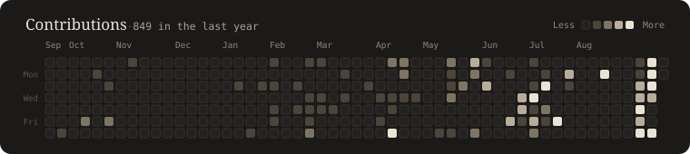

<!-- HERO:END -->

Founder of Te Vārtā · CS at FIU '27 · SWE intern at CoOrdio Health, summer 2026.

### Founder & Research

<!-- FOUNDER:START -->

  <a href="https://www.tevarta.com">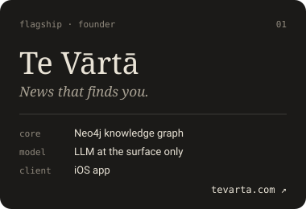</a>
  

<!-- FOUNDER:END -->

### Flagships

<!-- FLAGSHIPS:START -->

  <a href="https://github.com/Aaryan1524/ClaudeSentinel">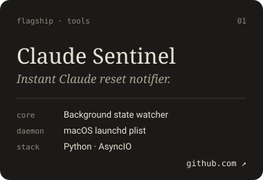</a>
  <a href="https://github.com/Aaryan1524/Shadow-PrincetonHacks-Education-Track-">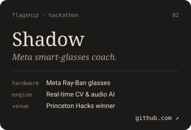</a>
  <a href="https://github.com/Aaryan1524/ReccursiveCommits">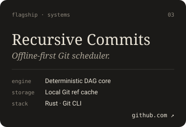</a>
  <a href="https://github.com/Aaryan1524/AgentSentinel">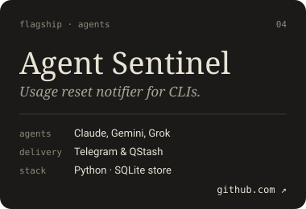</a>
  <a href="https://github.com/Aaryan1524/305Gemma-efficiencyproj">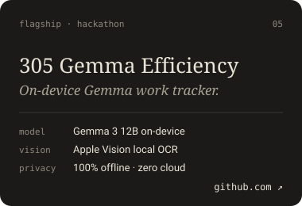</a>

<!-- FLAGSHIPS:END -->

### Work

<!-- REPOS:START -->

#### Tools and agents

<a href="https://github.com/Aaryan1524/ClaudeSentinel">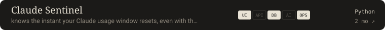</a> 
<a href="https://github.com/Aaryan1524/ReccursiveCommits">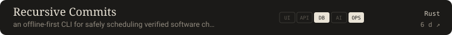</a> 
<a href="https://github.com/Aaryan1524/RepoParser">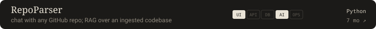</a> 
<a href="https://github.com/Aaryan1524/AgentSentinel">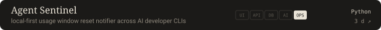</a> 

#### Markets

<a href="https://github.com/Aaryan1524/AI-loan-Repayment-">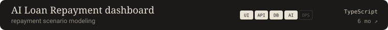</a> 
<a href="https://github.com/Aaryan1524/Personal_trading">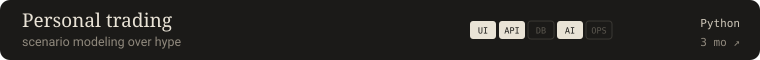</a> 
 

#### Hackathon

<a href="https://github.com/Aaryan1524/Shadow-PrincetonHacks-Education-Track-">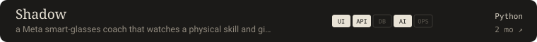</a> 
<a href="https://github.com/Aaryan1524/305Gemma-efficiencyproj">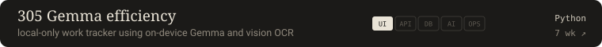</a> 

<!-- REPOS:END -->

Evidence: where each layer was detected

### Shipped, end to end

Each cell was read from source and links to the file that proves it.

<!-- MATRIX:START -->

| Project | Interface | API | Data | AI | Deploy | Idea → shipped |
|---|---|---|---|---|---|---|
| Te Vārtā | iOS | FastAPI | Neo4j | — | Actions | 1 day |
| [Shadow](https://github.com/Aaryan1524/Shadow-PrincetonHacks-Education-Track-) | [iOS](https://github.com/Aaryan1524/Shadow-PrincetonHacks-Education-Track-/blob/main/Shadow/ContentView.swift) | [FastAPI](https://github.com/Aaryan1524/Shadow-PrincetonHacks-Education-Track-/blob/main/backend/requirements.txt) | — | [Claude API](https://github.com/Aaryan1524/Shadow-PrincetonHacks-Education-Track-/blob/main/backend/requirements.txt) | — | — |
| [Claude Sentinel](https://github.com/Aaryan1524/ClaudeSentinel) | [CLI](https://github.com/Aaryan1524/ClaudeSentinel/blob/main/claude_usage_watcher.py) | — | [JSON state](https://github.com/Aaryan1524/ClaudeSentinel/blob/main/claude_usage_watcher.py) | — | [launchd](https://github.com/Aaryan1524/ClaudeSentinel/blob/main/launchd/com.claude-usage-watcher.plist) | 0 days |
| [Personal trading](https://github.com/Aaryan1524/Personal_trading) | [HTML](https://github.com/Aaryan1524/Personal_trading/blob/main/nifty-ai/frontend/index.html) | [FastAPI](https://github.com/Aaryan1524/Personal_trading/blob/main/nifty-ai/requirements.txt) | — | [Claude API](https://github.com/Aaryan1524/Personal_trading/blob/main/nifty-ai/requirements.txt) | — | — |
| [AI Loan Repayment dashboard](https://github.com/Aaryan1524/AI-loan-Repayment-) | [Next.js](https://github.com/Aaryan1524/AI-loan-Repayment-/blob/main/package.json) | [Next API](https://github.com/Aaryan1524/AI-loan-Repayment-/blob/main/src/app/api/advice/route.ts) | [Supabase](https://github.com/Aaryan1524/AI-loan-Repayment-/blob/main/package.json) | [Claude API](https://github.com/Aaryan1524/AI-loan-Repayment-/blob/main/package.json) | — | — |

*Cells detected from source on 2026-09-20.*

<!-- MATRIX:END -->

<!-- FOOTER:START -->

### Set in

Python · FastAPI · TypeScript · React · Next.js · Java · C# / .NET · Neo4j · PostgreSQL · Supabase · pgvector · spaCy · Claude API · Docker · AWS

### Correspondence

[www.tevarta.com](https://www.tevarta.com) · [X](https://x.com/aaryangajulaa) · [LinkedIn](https://www.linkedin.com/in/aaryangajula) · [aaryangajula17@gmail.com](mailto:aaryangajula17@gmail.com)

### Colophon

*Plates are SVG, rebuilt nightly by GitHub Actions.*

<!-- FOOTER:END -->
