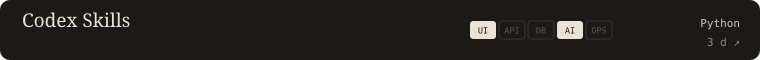
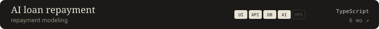
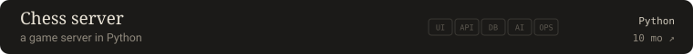
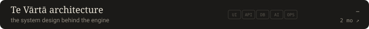
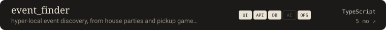
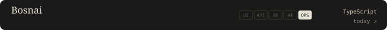
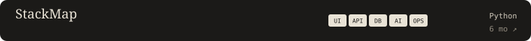
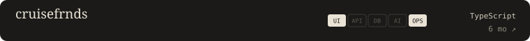
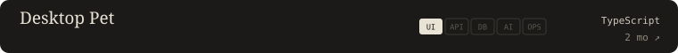

<!-- HERO:START -->

<!-- HERO:END -->

Founder of Te Vārtā · CS at FIU '27 · SWE intern at CoOrdio Health, summer 2026.

### Flagships

<!-- FLAGSHIPS:START -->

  
  

<!-- FLAGSHIPS:END -->

### Work

<!-- REPOS:START -->

#### Tools and agents

 
 
 
 
 
 

#### Markets

 
 
 

#### Systems

 
 
 

#### Products and hackathons

 
 
 
 
 
 
 
 

<!-- REPOS:END -->

Evidence: where each layer was detected

### Shipped, end to end

Each cell was read from source and links to the file that proves it.

<!-- MATRIX:START -->

| Project | Interface | API | Data | AI | Deploy | Idea → shipped |
|---|---|---|---|---|---|---|
| Te Vārtā | iOS | FastAPI | Postgres | — | Actions | 1 day |
| [Shadow](https://github.com/Aaryan1524/Shadow-PrincetonHacks-Education-Track-) | [iOS](https://github.com/Aaryan1524/Shadow-PrincetonHacks-Education-Track-/blob/main/Shadow/ContentView.swift) | [FastAPI](https://github.com/Aaryan1524/Shadow-PrincetonHacks-Education-Track-/blob/main/backend/requirements.txt) | — | [Claude API](https://github.com/Aaryan1524/Shadow-PrincetonHacks-Education-Track-/blob/main/backend/requirements.txt) | — | — |
| [Claude Sentinel](https://github.com/Aaryan1524/ClaudeSentinel) | [CLI](https://github.com/Aaryan1524/ClaudeSentinel/blob/main/claude_usage_watcher.py) | — | [JSON state](https://github.com/Aaryan1524/ClaudeSentinel/blob/main/claude_usage_watcher.py) | — | [launchd](https://github.com/Aaryan1524/ClaudeSentinel/blob/main/launchd/com.claude-usage-watcher.plist) | 0 days |
| [Personal trading](https://github.com/Aaryan1524/Personal_trading) | [HTML](https://github.com/Aaryan1524/Personal_trading/blob/main/nifty-ai/frontend/index.html) | [FastAPI](https://github.com/Aaryan1524/Personal_trading/blob/main/nifty-ai/requirements.txt) | — | [Claude API](https://github.com/Aaryan1524/Personal_trading/blob/main/nifty-ai/requirements.txt) | — | — |
| [event_finder](https://github.com/Aaryan1524/event_finder) | [Next.js](https://github.com/Aaryan1524/event_finder/blob/main/package.json) | [Next API](https://github.com/Aaryan1524/event_finder/blob/main/src/app/api/auth/%5B...nextauth%5D/route.ts) | [Supabase](https://github.com/Aaryan1524/event_finder/blob/main/package.json) | — | [Docker](https://github.com/Aaryan1524/event_finder/blob/main/websocket-server/docker-compose.yml) | 42 days |
| [Prompt Perfector](https://github.com/Aaryan1524/Prompt-Perfector-AI-) | [HTML](https://github.com/Aaryan1524/Prompt-Perfector-AI-/blob/main/index.html) | [Flask](https://github.com/Aaryan1524/Prompt-Perfector-AI-/blob/main/requirements.txt) | — | [Gemini](https://github.com/Aaryan1524/Prompt-Perfector-AI-/blob/main/requirements.txt) | — | — |

*Cells detected from source on 2026-09-16.*

<!-- MATRIX:END -->

<!-- FOOTER:START -->

### Set in

Python · FastAPI · TypeScript · React · Next.js · Java · C# / .NET · Neo4j · PostgreSQL · Supabase · pgvector · spaCy · Claude API · Docker · AWS

### Correspondence

[www.tevarta.com](https://www.tevarta.com) · [X](https://x.com/aaryangajulaa) · [LinkedIn](https://www.linkedin.com/in/aaryangajula) · [aaryangajula17@gmail.com](mailto:aaryangajula17@gmail.com)

### Colophon

*Plates are SVG, rebuilt nightly by GitHub Actions.*

<!-- FOOTER:END -->
